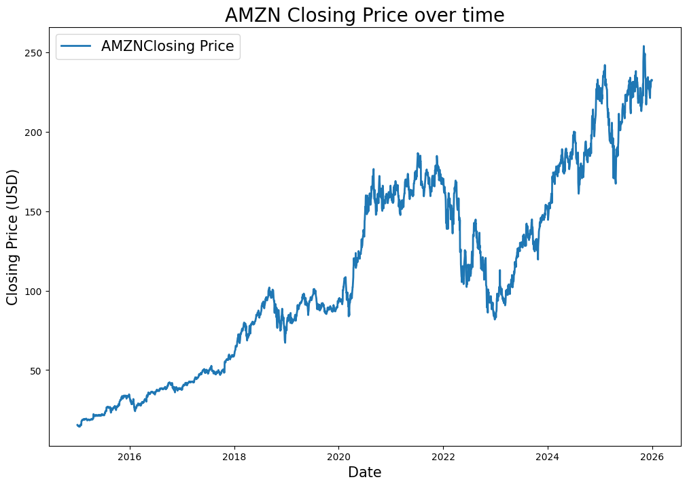
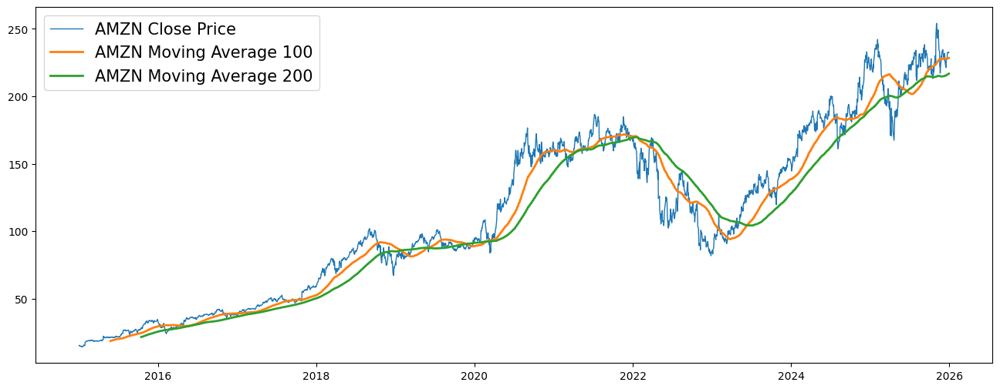
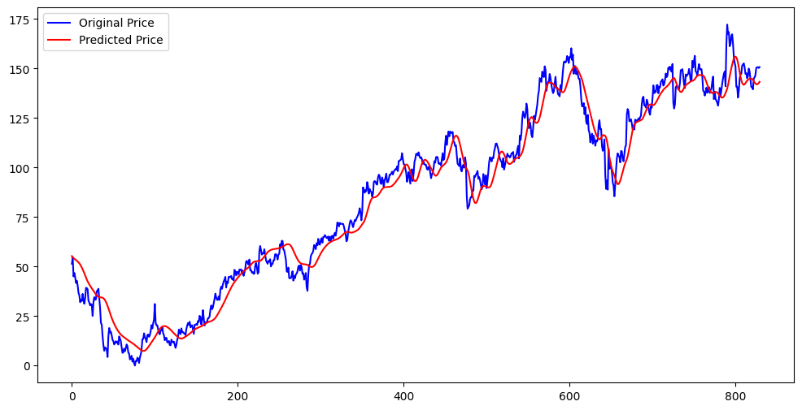

# Amazon Stock Price Forecasting using LSTM Networks

## Project Overview

This project explores the application of Long Short-Term Memory (LSTM) neural networks for forecasting stock prices using historical market data. Amazon (AMZN) stock data was collected from Yahoo Finance and analyzed to identify long-term trends, market behavior, and temporal patterns.

The workflow covers the complete machine learning pipeline, including data collection, exploratory data analysis, feature engineering, sequence generation, deep learning model development, and performance evaluation.

The primary objective is to investigate how recurrent neural networks can learn from historical stock price movements and generate future price predictions.

---

## Dataset

Historical stock data was obtained using the Yahoo Finance API through the `yfinance` Python library.

### Stock Analyzed

* Amazon (AMZN)

### Time Period

* January 2015 – Present

### Available Features

* Open Price
* High Price
* Low Price
* Close Price
* Adjusted Close Price
* Trading Volume

Since the data is downloaded programmatically, no separate dataset file is required.

---

## Exploratory Data Analysis

Before model development, the dataset was explored to understand its characteristics and identify important trends.

The analysis included:

* Dataset structure and summary statistics
* Missing value inspection
* Historical price movement analysis
* Trend visualization
* Distribution of stock returns

The notebook visualizes the evolution of Amazon's stock price over time using opening, closing, and high prices.

### Historical Stock Price Trend



---

## Moving Average Analysis

Moving averages are widely used technical indicators for identifying long-term market trends while reducing short-term fluctuations.

The following indicators were computed:

* 100-Day Moving Average
* 200-Day Moving Average

Comparing these moving averages with the actual closing price helps reveal periods of bullish and bearish momentum.

### Moving Average Visualization



---

## Daily Return Analysis

Daily returns were calculated to evaluate stock volatility and market behavior.

The analysis provides insights into:

* Price fluctuations
* Market risk
* Volatility patterns
* Frequency of gains and losses

Understanding return distributions is an important step in financial time-series analysis and forecasting.

---

## Data Preprocessing

To prepare the data for deep learning, several preprocessing steps were applied:

### Feature Scaling

Stock prices were normalized using Min-Max Scaling to improve model convergence and training stability.

### Sequence Generation

A sliding window approach was used where the previous 100 trading days were used to predict the next stock price.

This transforms the stock price series into a supervised learning problem suitable for LSTM networks.

---

## Model Architecture

The forecasting model is based on a stacked LSTM architecture designed to capture temporal dependencies in historical stock prices.

```text
Input Sequence (100 previous trading days)
            │
            ▼
LSTM (64 units)
            │
            ▼
Dropout (0.3)
            │
            ▼
LSTM (64 units)
            │
            ▼
Dropout (0.3)
            │
            ▼
LSTM (32 units)
            │
            ▼
Dropout (0.2)
            │
            ▼
Dense (25)
            │
            ▼
Dense (1)
            │
            ▼
Predicted Stock Price
```

The use of stacked LSTM layers allows the model to learn both short-term and long-term dependencies within the stock price sequence while dropout layers help reduce overfitting.

---

## Model Training

The model was trained using:

| Parameter       | Value                    |
| --------------- | ------------------------ |
| Optimizer       | Adam                     |
| Loss Function   | Mean Squared Error (MSE) |
| Epochs          | 30                       |
| Sequence Length | 100 Days                 |
| Training Split  | 70%                      |
| Testing Split   | 30%                      |

The model learns patterns from historical stock prices and uses them to forecast future values.

---

## Results

Model performance was evaluated by comparing predicted stock prices with actual market prices.

The evaluation metric used was:

### Root Mean Squared Error (RMSE)

RMSE measures the average prediction error and provides an interpretable estimate of forecasting accuracy.

### Actual vs Predicted Stock Prices



The results demonstrate that the LSTM model is capable of capturing the overall trend of Amazon's stock price and generating predictions that closely follow actual market movements.

---

## Repository Structure

```text
stock_price_prediction_lstm/
│
├── Stock_Analysis.ipynb
├── README.md
├── requirements.txt
│
├── images/
│   ├── closing_price.png
│   ├── moving_average.png
│   └── predicted_vs_actual.png
│
├── stock_lstm_model.keras
└── scaler.save
```

---

## Installation

Clone the repository:

```bash
git clone https://github.com/Khushi-Kumari030/stock_price_prediction_lstm.git
```

Move to the project directory:

```bash
cd stock_price_prediction_lstm
```

Install dependencies:

```bash
pip install -r requirements.txt
```

Launch Jupyter Notebook:

```bash
jupyter notebook
```

Open and run:

```text
Stock_Analysis.ipynb
```

---

## Future Improvements

Possible extensions of this project include:

* Multi-stock forecasting
* Real-time prediction dashboard
* Streamlit web application
* Integration of technical indicators (RSI, MACD, Bollinger Bands)
* GRU and Transformer-based forecasting models
* Hyperparameter optimization

---

## Key Learnings

This project provided practical experience in:

* Time-Series Forecasting
* Financial Data Analysis
* Deep Learning with LSTM Networks
* Data Preprocessing and Scaling
* Sequence Modeling
* Model Evaluation
* End-to-End Machine Learning Workflows

---
